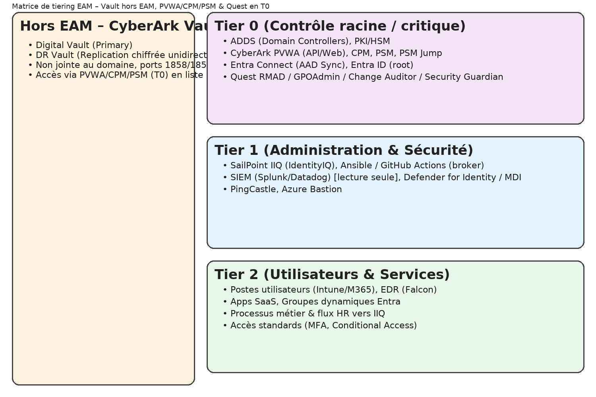
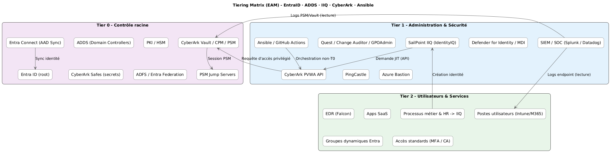

# TIERING_MATRIX – Classification des composants selon Microsoft EAM

> 💬 *“Control plane must always be smaller than data plane.” — Microsoft EAM Principle*

Ce document classe chaque composant, outil, agent et rôle de la solution **EntraID–ADDS–IIQ–CyberArk–Ansible** selon le modèle **Enterprise Access Model (EAM)**.

---

## 1️⃣ Rappel : les tiers EAM

| Tier | Description | Type d’accès | Objectif principal |
|------|--------------|---------------|--------------------|
| **T0** | Contrôle de l’identité et du bastion | Critique | Protéger les secrets, DC, PKI, bastions |
| **T1** | Administration de l’infrastructure et des applications | Sensible | Gérer les serveurs, IAM, outils de sécurité |
| **T2** | Environnements utilisateurs et opérations quotidiennes | Standard | Productivité, postes clients, SaaS |

---

## 2️⃣ Tableau de classification des composants

| Composant / Outil | Tier | Rôle / Fonction | Justification |
|--------------------|------|------------------|----------------|
| **Active Directory Domain Services (DCs)** | T0 | Contrôleur d’identité racine | Composant critique d’authentification |
| **PKI / HSM** | T0 | Services de certificats | Racine de confiance |
| **CyberArk Vault / CPM / PSM** | T0 | Gestion des secrets et sessions privilégiées | Accès au stockage des comptes sensibles |
| **CyberArk PVWA (API/Web)** | T0 | Interface du plan de contrôle du Vault | Administre directement les accès/requests/rotations |
| **Entra Connect / AAD Sync** | T0 | Synchronisation identité hybride | Flux identité sécurisé DC ↔ Entra |
| **Entra ID (tenant root)** | T0 | Autorité cloud | Gestion globale identité et PIM |
| **Quest RMAD / GPOAdmin / Change Auditor / Security Guardian** | T0 | Outils d’administration AD / GPO | Nécessitent accès admin délégué |
| **SailPoint IIQ (IdentityIQ)** | T1 | Gouvernance et provisioning | Gère les identités et rôles sans accès direct T0 |
| **Orchestrateur Ansible / GitHub Actions** | T1 | Workflow automatisé IIQ / CyberArk | Intermédiaire entre T1 et T0 |
| **Splunk / Datadog / SIEM** | T1 | Collecte et corrélation de logs | Accès lecture seule centralisé |
| **PingCastle** | T1 | Audit et hygiène ADDS | Collecte de configuration DC |
| **Defender for Identity / MDI / MDA / MDC** | T1 | Protection et détection AD | Sensor de sécurité à privilèges intermédiaires |
| **CrowdStrike Falcon** | T2 | EDR des postes utilisateurs | Couche endpoint non privilégiée |
| **PAW T0 / T1 / T2** | Tiers respectif | Poste de travail sécurisé dédié | Séparation physique et logique |
| **Postes clients standard (Intune)** | T2 | Utilisateurs métiers | Environnement productif |
| **CyberArk PSM Jump Servers** | T0 | Saut sécurisé | Accès isolé entre T1 et T0 |
| **ADFS / Entra Federation Services** | T0 | Authentification fédérée | Point d’entrée critique |
| **SIEM connectors (Syslog, API, REST)** | T1 | Intégration SOC | Accès en lecture contrôlé |
| **IIQ Connectors (SCIM, LDAP, JDBC)** | T1 | Connectivité applicative | Restreinte via comptes de service CyberArk |
| **Azure Bastion / JumpHost PRD** | T1 | Accès administrateurs cloud | Proxy d’accès contrôlé |
| **Ansible Control Node (Runner)** | T1 | Exécution orchestrée non-T0 | Automatisation avec isolation |
| **CyberArk Safe Accounts** | T0 | Coffres de stockage secrets | Contiennent identifiants DC / services |
| **Intune / Endpoint Manager** | T2 | Gestion périphériques | Gestion utilisateurs / device |
| **Exchange Online / M365** | T2 | Messagerie et collaboration | Services utilisateurs standards |

---

## 3️⃣ Carte ASCII simplifiée du modèle de flux EAM

```
          +-------------------+
          |     Tier 0        |
          |-------------------|
          | ADDS (DCs)        |
          | CyberArk Vault     |
          | PKI / HSM / Quest  |
          | AAD Connect        |
          +--------^-----------+
                   |
                   v
          +-------------------+
          |     Tier 1        |
          |-------------------|
          | IIQ (IdentityIQ)  |
          | PSM (sessions)    |
          | Ansible / GitHub  |
          | SIEM / SOC        |
          +--------^-----------+
                   |
                   v
          +-------------------+
          |     Tier 2        |
          |-------------------|
          | Intune / M365     |
          | Postes utilisateurs|
          | Apps SaaS / EDR   |
          +-------------------+
```

---

## 4️⃣ Bonnes pratiques de franchissement de tiers

| Principe | Description |
|-----------|--------------|
| **PAW dédiés** | Chaque tier doit disposer de ses propres PAW (Postes d’Administration Windows) |
| **Flux unidirectionnels** | Aucune session descendante (T2 → T1 / T1 → T0) non médiée |
| **Orchestration “non-T0”** | Tous les appels automatisés passent par un orchestrateur intermédiaire |
| **Isolation réseau** | VLAN, pare-feux et ACLs séparés par tier |
| **Contrôles CyberArk** | Utiliser PVWA comme seule interface d’appel vers le Vault |
| **JEA / JIT** | Just Enough Administration + Just-In-Time pour tout accès |
| **Monitoring croisé** | SIEM corrèle les logs des trois tiers pour détection d’anomalies |

---

## 5️⃣ Références normatives

| Réf. | Norme / Cadre | Description |
|------|----------------|-------------|
| [1] | **Microsoft EAM (Enterprise Access Model)** | Modèle de segmentation des privilèges |
| [2] | **NIST SP 800-53 rev5 (PR.AC)** | Access Control Tiered Management |
| [3] | **CIS Control 5 / 6 / 7** | Account Management & Privilege Separation |
| [4] | **ISO/IEC 27001:2022 A.9.2.3 / A.9.4.3** | Management of privileged access |
| [5] | **Zero Trust Maturity Model v2** | Segmentation, automation et least privilege |


---

## 6️⃣ Diagrammes

### 6.1 Vue PNG (prête à l'emploi)


### 6.2 Source PlantUML
Le diagramme PlantUML peut être compilé avec n'importe quel moteur PlantUML local ou en CI :
- Fichier : `./diagrams/tiering_matrix.puml`


