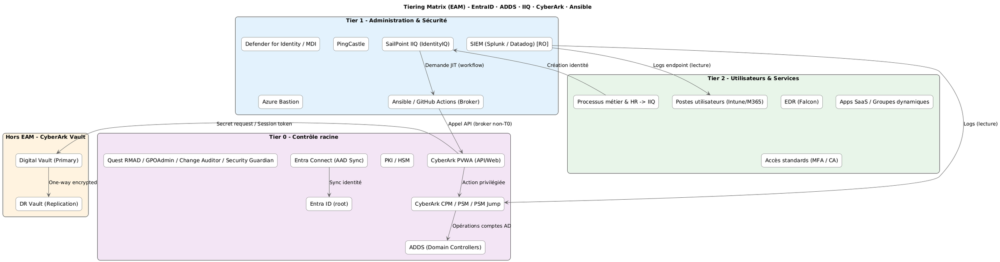

# TIERING_MATRIX – Classification des composants selon Microsoft EAM

> 💬 *“Control plane must always be smaller than data plane.” — Microsoft EAM Principle*

Ce document classe chaque composant, outil, agent et rôle de la solution **EntraID–ADDS–IIQ–CyberArk–Ansible** selon le modèle **Enterprise Access Model (EAM)**.

---

## 1️⃣ Rappel : les tiers EAM

| Tier | Description | Type d’accès | Objectif principal |
|------|--------------|---------------|--------------------|
| **T0** | Contrôle de l’identité et du bastion | Critique | Protéger les secrets, DC, PKI, bastions |
| **T1** | Administration de l’infrastructure et des applications | Sensible | Gérer les serveurs, IAM, outils de sécurité |
| **T2** | Environnements utilisateurs et opérations quotidiennes | Standard | Productivité, postes clients, SaaS |

---

## 2️⃣ Tableau de classification des composants (au sein d’AD/EAM)

| Composant / Outil | Tier | Rôle / Fonction | Justification |
|--------------------|------|------------------|----------------|
| **Active Directory Domain Services (DCs)** | **T0** | Contrôleur d’identité racine | Élément critique d’authentification |
| **ADFS / Entra Federation Services** | **T0** | Authentification fédérée | Point d’entrée critique |
| **PAW T0 / T1 / T2** | Tiers respectif | Poste de travail sécurisé dédié | Séparation physique et logique |
| **CyberArk Safe Accounts T0 / T1 / T2** | Tiers respectif | Coffres de stockage secrets dédiés| Contiennent identifiants DC / services |
| **PKI / HSM** | **T0** | Services de certificats | Racine de confiance AD |
| **CyberArk PVWA (API/Web)** | **T0** | Interface du plan de contrôle privilégié | Administre demandes, sessions et rotations |
| **CyberArk CPM / PSM / PSM Jump** | **T0** | Rotation & sessions privilégiées | Agissent directement sur comptes sensibles |
| **Quest RMAD / GPOAdmin / Change Auditor / Security Guardian** | **T0** | Outils d’admin & restauration AD/GPO | Interviennent sur DC, GPO, schéma, ACL |
| **Entra Connect (AAD Sync)** | **T0** | Synchronisation identité hybride | Flux identité sécurisé DC ↔ Entra |
| **Entra ID (tenant root)** | **T0** | Autorité cloud | Gouvernance globale, PIM |
| **SailPoint IIQ (IdentityIQ)** | **T1** | Gouvernance & provisioning | Orchestrateur sans accès direct T0 |
| **IIQ Connectors (SCIM, LDAP, JDBC)** | **T1** | Connectivité applicative | Restreinte via comptes de service CyberArk |
| **Ansible / GitHub Actions (Broker)** | **T1** | Orchestration non‑T0 | Relais contrôlé vers PVWA T0 |
| **Ansible / GitHub Actions (Broker)** | **T1** | Orchestration non‑T0 | Relais contrôlé vers PVWA T0 |
| **SIEM connectors (Syslog, API, REST)** | **T1** | Intégration SOC | Accès en lecture contrôlé |
| **SIEM (Splunk / Datadog)** | **T1** | Collecte centralisée (lecture)** | Lecture seule multi‑sources |
| **Defender for Identity / MDI** | **T1** | Détection identité AD | Sensor privilèges intermédiaires |
| **PingCastle** | **T1** | Hygiène & audit ADDS | Collecte de configuration DC |
| **Azure Bastion** | **T1** | Proxy d’accès administrateurs cloud | Accès contrôlé |
| **Postes utilisateurs (Intune/M365)** | **T2** | Environnement utilisateur | Productivité |
| **EDR (Falcon)** | **T2** | Protection endpoint | Non privilégié |
| **Apps SaaS / Groupes dynamiques Entra** | **T2** | Services utilisateurs | Accès standard (MFA/CA) |
| **Intune / Endpoint Manager** | **T2** | Gestion périphériques | Gestion utilisateurs / device |
| **Exchange Online / M365** | **T2** | Messagerie et collaboration | Services utilisateurs standards |

> **Note** : *Lecture seule* du SIEM signifie **pas d’altération** des sources T0/T1, uniquement ingestion.

---

## 3️⃣ Enclave hors EAM – CyberArk Digital Vault

| Composant | Tier | Rôle / Fonction | Justification |
|-----------|------|------------------|---------------|
| **CyberArk Digital Vault (Primary)** | 🚫 **Hors EAM** | Racine des secrets (plan de contrôle indépendant) | Non joint au domaine, flux restreints (1858/1859) |
| **CyberArk DR Vault (Replica)** | 🚫 **Hors EAM** | Reprise chiffrée unidirectionnelle | Isolation identique à la Vault primaire |

Les composants **PVWA/CPM/PSM (T0)** interagissent avec la Vault via des **flux chiffrés** et **liste blanche d’origines** ; la Vault n’est **jamais** jointe au domaine.

---

## 4️⃣ Carte ASCII simplifiée du modèle

```
  +-----------------------------+       +------------------------------+
  |     Hors EAM – Vault        |       |          Tier 0              |
  |-----------------------------|       |------------------------------|
  | Digital Vault (Primary)     |<----->| PVWA / CPM / PSM / DCs / PKI |
  | DR Vault (replication)      |       | Quest RMAD / GPOAdmin / etc. |
  +-----------------------------+       +------------------------------+
                                              ^
                                              |  (broker contrôlé)
                                        +-----+-----+
                                        |   Tier 1  |
                                        | IIQ / Ansible / SIEM |
                                        +-----+-----+
                                              |
                                              v
                                        +-----------+
                                        |  Tier 2   |
                                        |  Users    |
                                        +-----------+

---

## 4️⃣ Bonnes pratiques de franchissement de tiers

| Principe | Description |
|-----------|-------------|
| **PAW dédiés** | PAW‑T0 / PAW‑T1 / PAW‑T2 distincts |
| **Broker T1→T0** | Orchestration via Ansible/GitHub (jamais d’appel direct T1→Vault) |
| **Isolation réseau** | VLAN/ACL/pare‑feu séparés par tier + enclave Vault dédiée |
| **JEA/JIT** | Just Enough + Just‑In‑Time pour tout accès privilégié |
| **SIEM lecture seule** | Corrélation T0/T1/T2 sans écriture sur sources |

---

## 5️⃣ Références normatives

| Réf. | Norme / Cadre | Description |
|------|----------------|-------------|
| [1] | **Microsoft EAM (Enterprise Access Model)** | Modèle de segmentation des privilèges |
| [2] | **NIST SP 800-53 rev5 (PR.AC)** | Access Control Tiered Management |
| [3] | **CIS Control 5 / 6 / 7** | Account Management & Privilege Separation |
| [4] | **ISO/IEC 27001:2022 A.9.2.3 / A.9.4.3** | Management of privileged access |
| [5] | **Zero Trust Maturity Model v2** | Segmentation, automation et least privilege |


---

## 6️⃣ Diagrammes

### 6.1 Vue PNG (prête à l'emploi)


### 6.2 Source PlantUML
Le diagramme PlantUML peut être compilé avec n'importe quel moteur PlantUML local ou en CI :
- Fichier : `./diagrams/tiering_matrix.puml`


